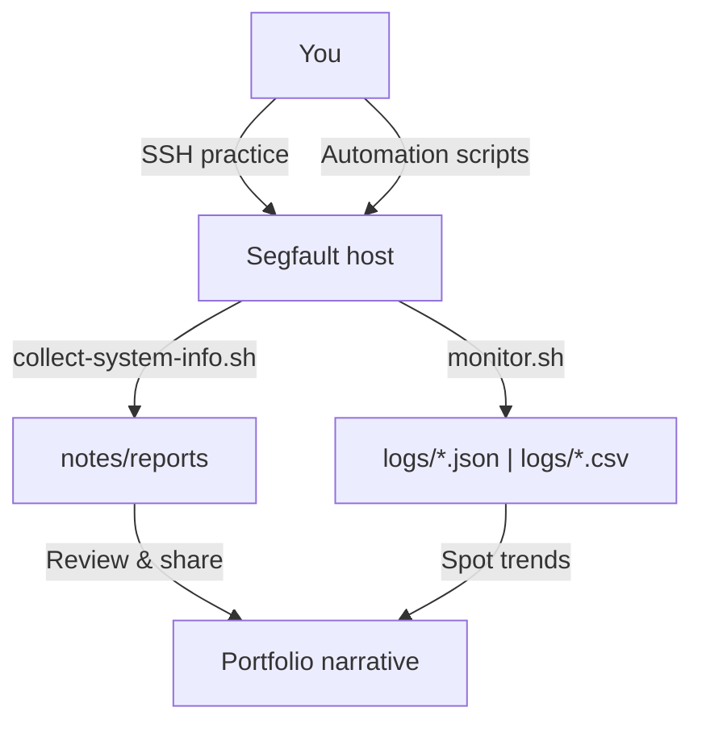
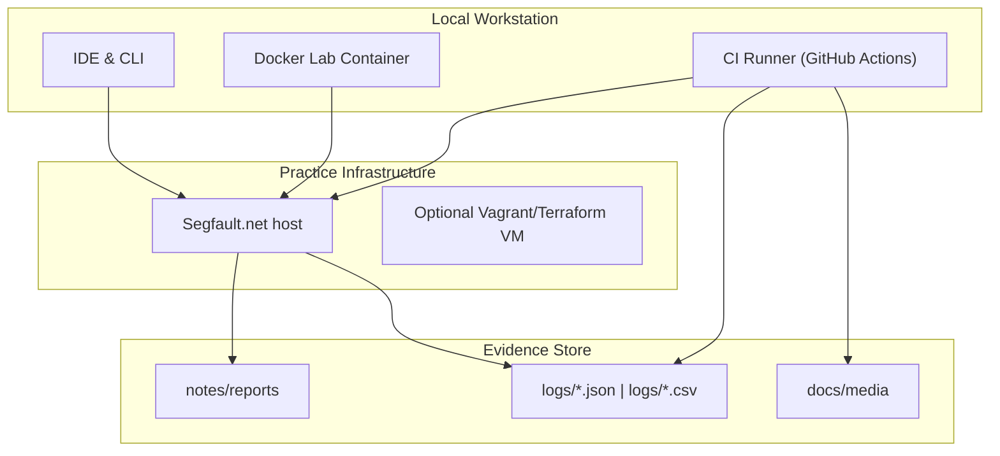

# 🐧 Remote Linux Lab (Segfault.net Playground)

[](#ci-cd-automation)
[](#ci-cd-automation)
[](LICENSE)
[](#local-lab-containers)

Practice real-world DevOps on Segfault.net sandboxes, capture the evidence, and tell the story clearly.

## Overview

Remote Linux Lab is a portfolio-ready playbook for getting confident with day-to-day SRE and sysadmin tasks:

- Spin up into Segfault.net hosts, secure access, and keep living documentation.
- Automate repeatable diagnostics so every session leaves an auditable trail.
- Package the experience so a reviewer understands the impact without reading the source first.

### How the pieces connect



#### Environment layers at a glance



#### Visual walkthrough (placeholders)

- **SSH login snapshot** — add `docs/media/ssh-login.png` once captured during a Segfault session.
- **Automation run GIF** — record `collect-system-info.sh` in action and store it as `docs/media/collect-run.gif`.
- **Report review screenshot** — drop a rendered Markdown report image at `docs/media/report-review.png`.

## Setup

1. **Clone & install tooling**
   - `git clone https://github.com/<you>/remote-linux-lab.git`
   - Ensure Bash ≥ 5.0, `ssh`, and `jq` are available locally.
2. **Create your Segfault alias**
   - Copy the provided SSH key into `~/.ssh/segfault` with `chmod 600`.
   - Add a host entry (e.g. `releasecoffee`) in `~/.ssh/config` pointing to `root@segfault.net` with the key.
3. **Dry-run the automation**
   - `./scripts/collect-system-info.sh releasecoffee`
   - `./scripts/monitor.sh --format json --once`
4. **Review generated artifacts**
   - Markdown reports land under `notes/reports/`.
   - Structured metrics land under `logs/`.

## Use Cases

- **Interview walk-through** — Show a recruiter how you approach SSH hygiene, monitoring, and documentation in one narrative.
- **Practice ground** — Re-run the scripts before a new on-call rotation or certification exam to warm up muscle memory.
- **Drift detection** — Capture diffs against a hardened SSH baseline and keep them in version control.
- **Teaching aid** — Pair the README and scripts with live demos when onboarding juniors to remote server workflows.

---

## 🚀 Skills in Focus

- **SSH Hygiene** — logging in securely, managing identity files, and using friendly host aliases.
- **System Awareness** — checking quotas, uptime, and hardware limits so surprises are caught early.
- **File Operations** — editing configuration files in `nano` and `vim`, and moving artifacts with `scp` or `sftp`.
- **Session Reliability** — keeping work alive with `tmux` and understanding background execution with `nohup`.

---

## 🖥️ Walkthrough at a Glance

1. **Connect to the sandbox** — `ssh root@segfault.net` (password: `segfault`).
2. **Capture your key material** — store the provided OpenSSH key under `~/.ssh/` with strict permissions.
3. **Create a shortcut** — add a host alias like `releasecoffee` in `~/.ssh/config` so future logins are one command.
4. **Check system health** — run `cat /config/self/limits`, `df -h`, and `du -sh /sec` to understand resource limits and storage types.
5. **Edit safely** — practise in `nano` and `vim` so you can handle quick fixes as well as modal editing sessions.
6. **Move files around** — copy artifacts back home with `scp releasecoffee:/sec/hello.py ~/Downloads/` to verify transfer workflows end-to-end.

---

## 📚 What Each Session Reinforced

- Ephemeral disks reset on each boot, while `/sec` is encrypted storage that survives restarts—store important notes there.
- Solid SSH hygiene (keys, configs, permissions) pays off when rotating hosts or sharing access reviews.
- Comfort with both `nano` and `vim` prevents emergencies when only one editor is available on a stripped-down server.
- Transfers via `scp`/`sftp` close the loop between remote experiments and local documentation.
- Lightweight monitoring commands (`uptime`, `who`, `ps`, `df`) give a quick pulse check without needing a full observability stack.

---

## 🔗 Why This Project?

**Case study for recruiters:** Remote Linux Lab mirrors how I spin up on a new SRE team. Week one is about gaining safe access (SSH hygiene, key rotation, aliasing). Week two is about learning the estate (lightweight monitoring, documentation). Week three is about improving reliability (automation, baselines, CI). The repo captures that arc so a reviewer can see how I reason, not just which commands I typed.

- **Onboarding simulation** — demonstrate how I bootstrap into an unfamiliar fleet, document tribal knowledge, and leave guardrails for the next engineer.
- **On-call readiness** — rehearse the exact diagnostics I would run during a Sev2, then export the markdown trail for post-incident review.
- **Continuous improvement** — layer in automation (GitHub Actions, Docker lab, Terraform/Vagrant stubs) to show how practice environments evolve toward production discipline.

The result is a narrative artifact: clone the repo, skim the reports, and you immediately understand how I operate under pressure.

---

## 📂 Project Structure

```
remote-linux-lab/
│
├── logs/                    # Sample structured metrics generated by monitor.sh
├── README.md                # Project documentation (this file)
├── examples/
│   ├── hello.py             # Demo Python script used for transfer exercises
│   └── sshd_config.baseline # Sanitized SSH baseline for drift detection
├── scripts/
│   ├── collect-system-info.sh  # Collects remote diagnostics into Markdown reports
│   ├── monitor.sh              # Exports CPU/memory/disk usage in JSON or CSV
│   └── ssh-audit.sh            # Checks SSH settings against guardrails
└── notes/
    ├── first-session.md     # Narrative recap of the initial sandbox session
    ├── 2025-09-18.md        # Security-focused session notes with baseline guidance
    └── reports/             # Generated system diagnostic reports
```

---

## 🧭 Guided Scenarios

**Scenario A — New host onboarding**
- Run `./scripts/collect-system-info.sh releasecoffee` immediately after gaining access.
- Capture limits, uptime, services, and security posture into `notes/reports/` for visibility.
- Share the markdown with peers to align on baseline expectations.

**Scenario B — Incident drill (performance spike)**
- Launch `./scripts/monitor.sh --format json --count 12 --interval 5` to produce a one-minute pulse.
- Pipe the JSON into `jq` or a dashboard to spot CPU, RAM, and disk anomalies.
- Commit the snapshot alongside your incident notes to document response steps.

**Scenario C — Security audit and drift watch**
- Record a hardened baseline under `examples/sshd_config.baseline`.
- Run the optional diff via `SSHD_BASELINE=examples/sshd_config.baseline ./scripts/collect-system-info.sh releasecoffee`.
- Follow up with `./scripts/ssh-audit.sh releasecoffee` (see below) to log any insecure authentication options.

---

## 🛠️ Automation Reports

Use the automation helpers to gather evidence after each practice run.

### System diagnostics (Markdown)

1. Ensure your SSH shortcut (e.g., `releasecoffee`) works without prompts.
2. Run `./scripts/collect-system-info.sh` to gather uptime, resource usage, running services, and recent logs.
3. Review the timestamped Markdown report under `notes/reports/`—each file captures the exact state of the box.
4. Focus on the **Security Posture** section to see SSH authentication policy, firewall state, Fail2ban activity, and any listening sockets that expose the host beyond `localhost`.

Optional extras:

- Set `SSHD_BASELINE=/path/to/sshd_config` before running the script to append a config diff at the end of the report.
- Override the output directory with `REPORT_BASE=custom/dir ./scripts/collect-system-info.sh` when you want to stash reports elsewhere.
- Use the [SSHD Baseline Playbook](docs/ssh-baseline.md) to capture a hardened reference config and keep drift visible.

Pass a different SSH host alias or `user@host` as the first argument when you want to target another Segfault instance.

### Structured metrics (JSON/CSV)

- `./scripts/monitor.sh --format json --count 3` exports newline-delimited snapshots ready for dashboards.
- `./scripts/monitor.sh --format csv --count 10 --interval 30` appends spreadsheet-friendly rows for trend tracking.
- Outputs default to `logs/`, so reviewers can skim real data without running the tooling themselves.

### Security automation (SSH audit)

- `./scripts/ssh-audit.sh releasecoffee` captures `sshd -T` output, highlights risky flags (e.g., password auth), and stores the results under `notes/reports/audit-*`.
- Pair the audit with the baseline diff to show recruiters you can spot config drift before it bites prod.
- Ship the log as part of an incident retro or compliance evidence bundle.

---

## ⚙️ CI/CD Automation <a id="ci-cd-automation"></a>

GitHub Actions keeps the bash tooling honest and publishes fresh evidence artifacts on every PR.

```yaml
name: lab-ci
on:
  pull_request:
  push:
    branches: [ main ]

jobs:
  lint-and-sample:
    runs-on: ubuntu-latest
    steps:
      - uses: actions/checkout@v4
      - name: ShellCheck scripts
        run: shellcheck scripts/*.sh
      - name: Generate sample report
        run: |
          mkdir -p artifacts
          ./scripts/monitor.sh --format json --count 2 --output artifacts/metrics.json
      - uses: actions/upload-artifact@v4
        with:
          name: sample-metrics
          path: artifacts/
```

Tailor the workflow to run on schedule (`workflow_dispatch` + cron) if you want recurring practice snapshots.

---

## 🐳 Local Lab Containers <a id="local-lab-containers"></a>

Prefer to rehearse locally before touching Segfault? Use the Dockerfile to spin up an ephemeral playground:

```bash
docker build -t remote-linux-lab .
docker run --rm -it \
  -v "$PWD"/notes:/workspace/notes \
  remote-linux-lab /bin/bash
```

Inside the container you can invoke the scripts against localhost or tunnel back to Segfault via mounted SSH keys.

---

## 🏗️ Infrastructure-as-Code Options

- **Terraform module stub** — declare a quick `segfault` workspace or cloud VM (AWS Lightsail/DigitalOcean) using `terraform apply` for private practice.
- **Vagrantfile** — mirror the Segfault constraints locally, then run the same scripts to validate they behave on Ubuntu/Debian images.
- Keep the configs in `iac/` (planned) so recruiters can see how you standardise environments across clouds.

---

## 📘 Guides & Playbooks

Deep dives that capture the core skills I'm practicing:

- [SSH Access Playbook](docs/ssh-access.md) — shortcuts, key management, troubleshooting.
- [System Monitoring Cheatsheet](docs/system-monitoring.md) — commands for CPU, memory, storage, network, services.
- [File Transfer Recipes](docs/file-transfers.md) — `scp`, `rsync`, and `sftp` workflows.
- [Editing on Remote Hosts](docs/editors.md) — nano/vim fundamentals and safety tips.
- [DevOps Fundamentals Checklist](docs/devops-basics.md) — hygiene, automation, and documentation habits.
- [SSHD Baseline Playbook](docs/ssh-baseline.md) — capture and maintain configs for drift detection.

---

## 🎬 Demo & Media

- [Placeholder video walkthrough](https://youtu.be/demo-placeholder) — replace with a Loom or YouTube link that shows login → automation → report handoff.
- Capture GIFs or screenshots from the Visual walkthrough list once you run the scripts end-to-end.

---

## 🤝 Contributing & Templates

- See [`CONTRIBUTING.md`](CONTRIBUTING.md) for style guides, shell linting expectations, and review checklists.
- Issue templates live under `.github/ISSUE_TEMPLATE.md`; pull request template under `.github/pull_request_template.md` (both include recruiter-friendly prompts about evidence and testing).
- Open an issue tagged `good first job` to propose new scenarios or automation improvements.

---

## 🏁 Skills

Linux • DevOps • SRE • Bash • CI/CD • Docker • Terraform • Monitoring

---

## ✅ TODO (Next Steps)

- Replace media placeholders with real screenshots and GIFs captured from a full lab run.
- Record a short Loom/YouTube walkthrough and swap it into the Demo & Media section.
- Hook up GitHub Actions using the provided workflow so the status badges reflect live runs.

---

## 🏷️ Topics

`linux` · `ssh` · `devops` · `sysadmin` · `cloud` · `vim` · `nano` · `scp` · `learning-project` · `portfolio`
